# Primitive Age

Welcome to Assembly Line Machines! 

The first thing you're going to want to do is take a Pickaxe of mining level Diamond or higher (e.g. Iron Pickaxe) and venture into the earth to look for Titanium Ore (Found between Y8 and Y16), which can smelted into bars for later use.

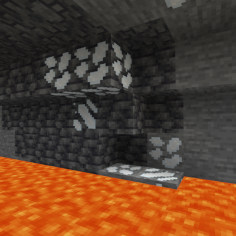

*(Titanium and it's Deepslate variant)*

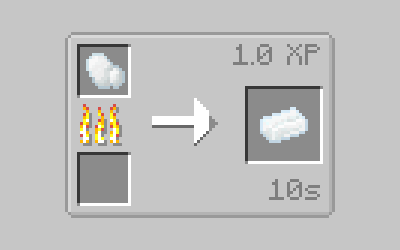

# Fluid Bath

Your first recipes will be made in the fluid bath.

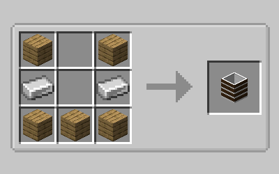

Fluid bath recipes take 2 items and a liquid to produce new materials for you to use. First RIGHT-CLICK with the fluid used for the recipe, and then with the two items at which point the fluid should turn a different color (Pictured below). 

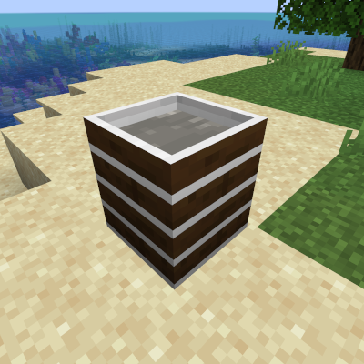

The next step once you have a valid recipe in the fluid bath is to make a stirring stick, note that stirring sticks use durability to process recipes so it's useful to have a couple on hand! (Your first ones will be made out of wood, though stronger ones will be available later on in progression)

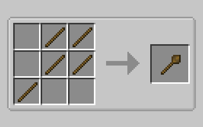

Once you have a stirring stick or two created, simply hold RIGHT-CLICK on the fluid bath with the stick in your main hand to start creating the recipe. After a few seconds a portion of the fluid inside the bath will be consumed and it will spit out the desired item!

!!! warning "Be careful!"
    If an ivalid recipe is loaded into the fluid bath and processed, it will produce sludge instead of the desired product, so be careful when putting in your recipes!

The first recipe you will need to make using the fluid bath is Silt which is made using gravel and sand in the fluid bath with water (if you mess up, simply SHIFT+RIGHT-CLICK to clear the recipe), which you can then craft into silt bricks for the next step! 

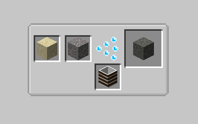

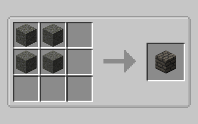

# Manual Grindstone

With silt bricks now aquired, you're ready to craft the Manual Grindstone for the next set of processing!

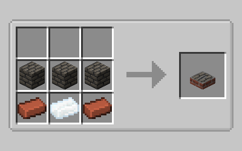

Once crafted, the manual grindstone also requires various blades for functioning. Blades, like stirring sticks, also have a durability associated with them that will decrease as you grind (your first one will be made out of titanium, though stronger ones will be avialable later on in progression).

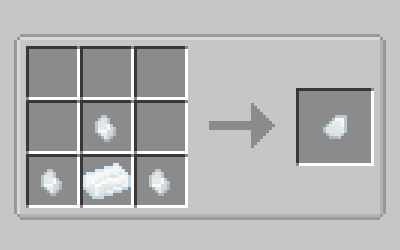

*(Blade Pieces use nuggets for their creation)*

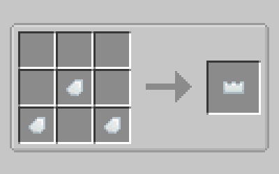

Once you've crafted the blade, simply RIGHT-CLICK on the manual grindstone with the blade to attach it (You may also SHIFT+RIGHT-CLICK to remove it from the grindstone)

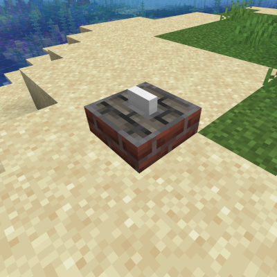

*(Manual Grindstone w/ a Titanium Blade attached)*

Now with your grindstone you are able to grind down bars and other materials into dusts for further use, simply hold RIGHT-CLICK with the item you wish to grind in your main hand and after a couple of seconds it will be turned into the ground version of itself!

??? tip

    Grinding down raw ores on the manual grindstone will yield twice the output as opposed to normal smelting!

# Finishing off the Primitive Age

With both the fluid bath and manual grindstone aquired you are ready for the final piece of progression in this age! What you will need is a fair amount of ground iron and ground gold (aquired from either bars or raw ore in the manual grindstone), once aquired you can combine the ground iron & ground gold with silt and water in the fluid bath to yield Gold Silt and Iron Silt. Simply smelt the Ore Silts to aquire their pure variants, you will need many pure bars for future progression!

!!! note

    This process can also be done for both Titanium and Copper, though they are not useful at this point in the progression

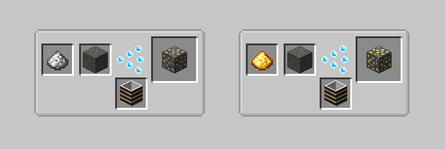

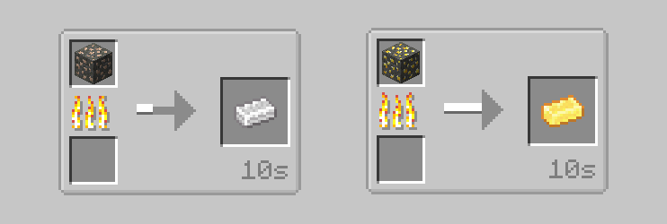

The next two things you'll want to make are upgrades to your stirring stick and grindstone blade.

??? tip

    The following section will require a lot of lava for use in the fluid bath, you may want to keep a bit a of a stockpile on hand!

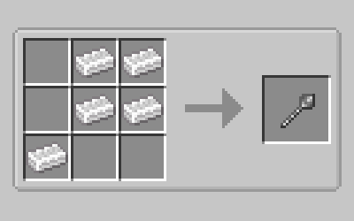

*(Pure Iron Stirring Stick recipe)*

For the Pure Gold-Dipped Blade, you will first want to combine a titanium blade piece and a pure gold ingot with lava in a fluid bath.

!!! warning "Be careful!"
    Any fluid bath recipes involving hot liquids such as lava will **require** a pure iron stirring stick or higher

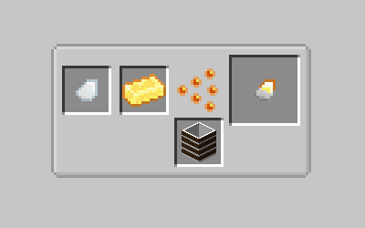

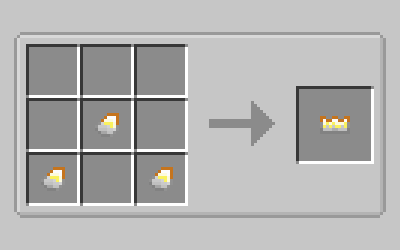

Once you have the pure gold-dipped blade, you will be able to start making steel which is the final product of this age and required to move on to the next! To start making steel you will first need to grind down either Coal or Charcoal into their ground variants.

!!! note

    Grinding down coal or charcoal **requires** a pure gold-dipped blade to be attached to the manual grindstone.

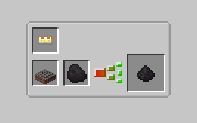

??? info

    Ground charcoal is made in the exact same way, and may be used interchangeably with it's regular counterpart

The final step involves combining your ground coal and ground iron with lava in a fluid bath, this will yield your first ingot of steel as well as your advancement to the Crank-Age!

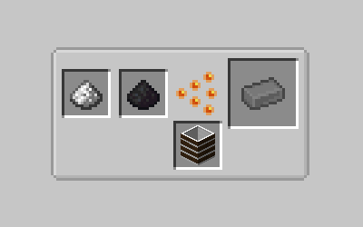

!!! tip   
    
    Once you've aquired your first ingots of steel, you may also want to further upgrade your stirring stick and grindstone blade as you will need quite a bit of steel to move onto the next age!

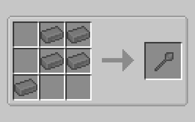

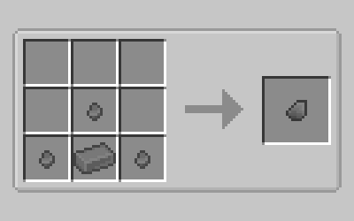

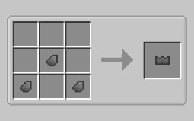

# End of Chapter