# Crank Age (Kinetic Energy)

With the creation of steel you are ready to move on to the crank age! Like the name implies, in this age you'll be moving from doing everything manually to using crank power for a semi-automated setup.

## Simple Grinder and Crank Power

The first thing you'll want to do is upgrade your fluid bath and manual grindstone into their simple variants. Starting off with the Simple Grinder!

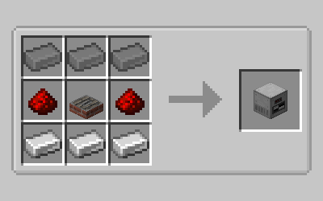

There's still a bit to do before your grinder is ready to use, because every machine in this age requires crank power, the next thing you'll want to craft is a crank!

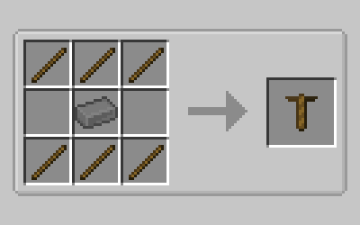

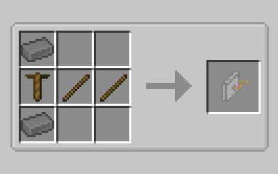

With the crank acquired you're ready to start using the simple grinder. First place down the simple grinder, because simple machines do not have an internal output slot you'll want to place a chest (or any valid storage entity) on the right-hand side to store any output items you create. Afterwards simply SHIFT+RIGHT-CLICK with the crank in your main hand on any other available side of the simple grinder to attach it, the full multiblock should look something like this.

!!! warning "Be careful!"

    The output inventory **has** to be on the **right-hand side** of the machine or it will not output.

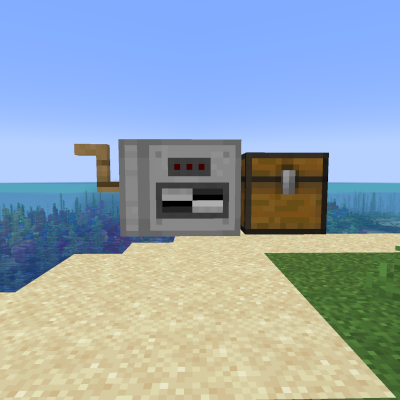

Once you've made the simple multiblock structure you're ready to start grinding. Thankfully the GUI's fairly straight forward so we'll run through that quickly.

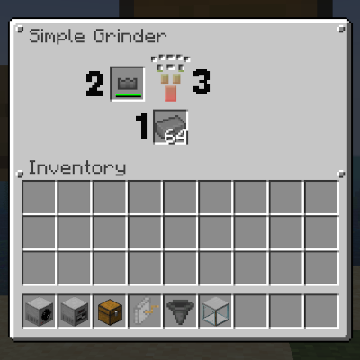

1.  Input slot for the Simple Grinder

2.  Blade slot (Note that the simple grinder will still consume durability on blades while you process recipes)

3.  Progress bar (once this fills up the output will be pushed to the inventory on its right)

Once you've put in a valid recipe you'll want to start processing it. To do this just hold RIGHT-CLICK on the crank you attached, the crank should start emitting particles and the machine should start its processing animation.

!!! warning "Be careful!"

    If you try to power the machine with a crank while no valid recipe is within its input slot, or the output slot is full; then there's a chance that your crank may break with every RIGHT-CLICK dropping sticks and steel-nuggets.

The first recipe you'll want to make with the simple grinder is steel rods, which can then be crafted into the Simple Fluid Mixer.

??? note inline end

    This recipe can only be made in the simple grinder, using a manual grindstone will not work.

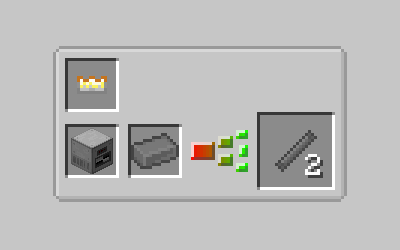

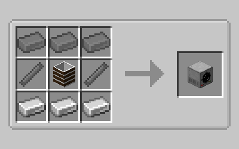

## Simple Fluid Mixer and the Gearbox

With the Simple Fluid Mixer crafted you're ready for the next step! The first thing you'll want to do is craft a tank to store liquids in.

??? info inline end

    Wooden Boards can be crafted with every type of wood (including warped and crimson), using logs will yield more boards.

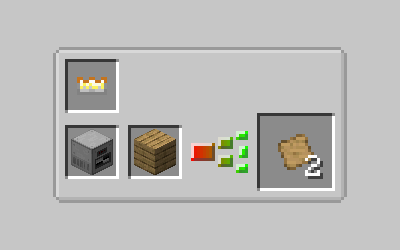

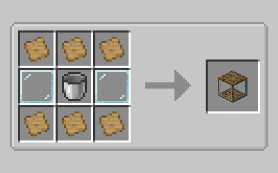

??? tip inline end

    Either a wooden or steel tank can be used for the simple fluid mixer, however the wooden tank has less fluid storage as well as cannot store hot liquids (such as lava), every tank variant retains fluid NBT data when broken allowing for mass transport.

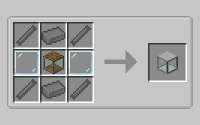

Once you have your tank you can set up the multiblock, the setup is exactly the same as the simple ginder, however the bottom of the block **must** have a valid fluid storage in order to operate. If set up correctly the multiblock should look like this!

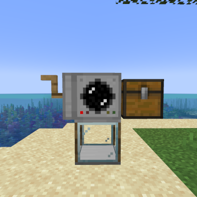

Now you're ready to start processing more advanced mixing recipes, while processing works the exact same way as the simple grinder, the way recipes are processed and the GUI are a little different so let's run over that really quick.

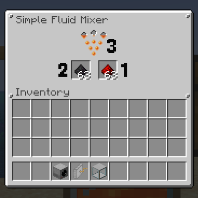

1.  First input slot.

2.  Second input slot.

3.  Progress bar, the liquid used in the recipe (and the same one drawn from the tank below) will change the animation of the fluid mixer as well as the progress bar (this recipe is using lava)

??? tip inline end

    Make sure to keep the tank filled in with the required liquid until you're done processing all of the materials you need or your crank may break!

Recipes are processed the exact same way as the simple grinder, simply hold RIGHT-CLICK on the attached crank until the recipe is done processing.

The next thing you'll want to make with the simple fluid mixer is Empowered Coal.

??? tip inline end

    Empowered coal is twice as efficient as regular coal in fuel burning machines!

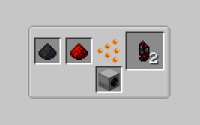

With this empowered coal you're ready to start making the gearbox, first craft a hammer out of either titanium or steel.

??? note inline end

    Titanium hammers only require sticks, instead of steel rods.

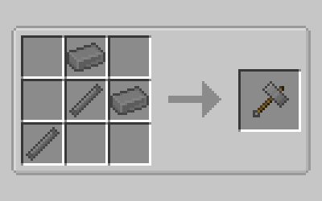

??? note inline end

    Any pure ingot can be used to craft plates and gears, and likewise the gearbox or any other gear requiring recipe, however the amount of plates/gears received depend on the material used. Pure Copper is used here as it provides a much higher plate/gear per ingot as the other pure metals. You can obtain pure copper via the same method used to obtain pure gold/iron.

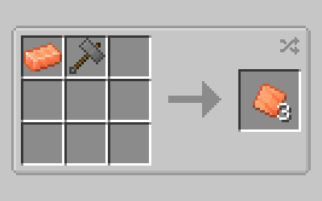

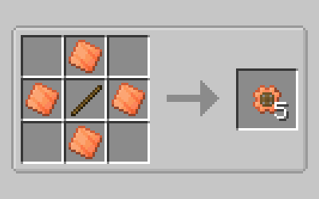

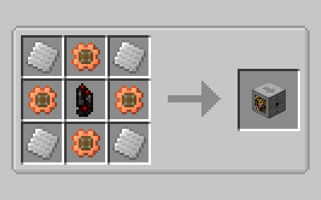

And with that you've made your first gearbox! Simply attach it to any simple machine like you would a crank and you can start using it!

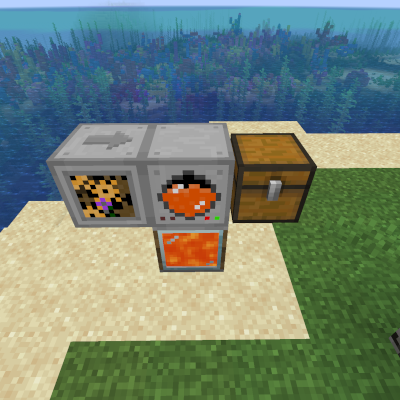

!!! note

    The arrow on top of the gearbox will tell you which machine it is facing.

The gearbox GUI is a little more complex as it is your first machine that can accept upgrades. So let's run through it really quick.

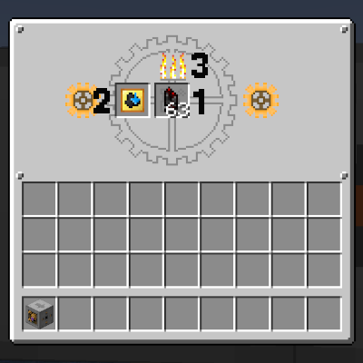

!!! note inline end

    The gearbox will **ONLY** consume empowered coal and its upgrades as a valid fuel source. Coal and Charcoal will not work inside without a Fuel Compatibility upgrade.

1.  Fuel slot

2.  Upgrade slot (This machine upgrade slot currently has a Gearbox Upgrade: Efficiency inside)

3.  Fuel burn indicator, the flames will slowly fall like a furnace as the gearbox operates. Once it runs out it will consume another fuel.

With the gearbox you can finally get rid of most of the manual work in this age and move on to the next step!

## Crank Charger, Crank-Powered Tools, and Black Granite

The final part of this age will require obtaining black granite, a material which spawns in the nether. However there are a couple of things to do before you can harvest it.

The first will be the creation of a Crank Charger and Crank-Powered Tools (of which you will only need the crank-powered pickaxe), which will be needed in order to successfully harvest the Black Granite.

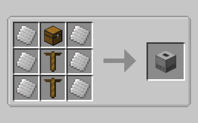

??? note inline end

    Crank-Powered tools are created exactly the same as their vanilla counterparts (exactly like the titanium hammer, for the hammer variant) with the exception of using either Gold or Titanium gears as the material and Steel Rods as the sticks. Note that it **must** be either Gold or Titanium gears, I used titanium in this example as it is less resource intensive than gold. Obtaining the plates and gears is the same as above, as well as the creation of pure titanium.

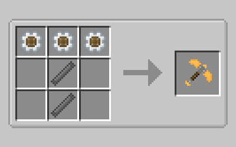

Crank-Powered Tools as their name suggests, uses cranks to break blocks and deal damage, every crank tool has an internal storage of 750 cranks of which it will consume 1 crank per operation (breaking a block, dealing damage) which can be recharged using the crank charger. Storing cranks in the tools using a crank charger is done by building a multiblock which should look like this when constructed successfully.

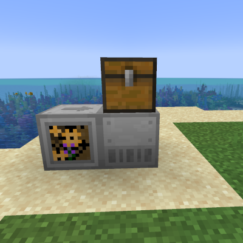

Simply put your crank tools in the inventory above the crank charger and supply crank power to the charger itself (only through a gearbox) and it will start to store cranks within the tool, starting from first on the left and ending at the last to the right, top to bottom.

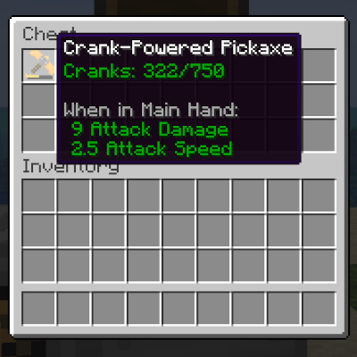

With your fully charged crank pickaxe in hand your next task is to find black granite in the nether! Black granite spawns anywhere in netherrack in large veins (pictured below).

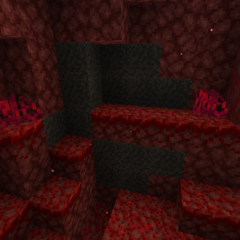

With black granite obtained you've reached the end of the Crank-Age and the dawn of the Electricity-Age!

#End of Chapter

