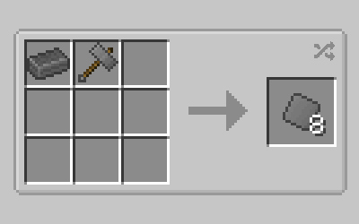

# Electricity Age Part A (Logistics and Machines)

!!! danger "Out-of-date Information"
    The information contained in this article is not up-to-date and will not be maintained. For documentation, install [Patchouli](https://www.curseforge.com/minecraft/mc-mods/patchouli), an in-game rich documentation viewer.
    
With the acquisition of black granite you're ready to enter into the largest age, FE! In this age you'll finally move from semi-automated cranking to everything from mob farming, fully automated ore doubling through the use of vastly superior logistics systems, to the creation of advanced synthetic materials.

## The Electric Purifier, Pipes, and Pure Steel

The first thing you'll want to do in this age is craft an electric purifier.

??? note inline end

    The recipe for the electric purifier *requires* titanium plates, other plates will not work. For gears you can use either Titanium or Gold.

Much like the previous age, some framework is required before your purifier is ready to use. First up will be basic energy pipes, your first method of FE transfer, as well as item pipes for transporting items over long distances, and fluid pipes for liquid transportation.

??? note inline end

    All piping must use iron plates.

And lastly you'll need some way to generate FE, thankfully your crank energy isn't totally useless yet! With the use of a specialized block called the Crankmill you're able to convert previous crank energy into precious FE!

??? note inline end

    Must use iron plates.

The way the crankmill operates is a little different to the other ways of generating FE in this mod, first of all is the full multiblock.

??? note inline end

    The side that you plug your crank energy into will ALWAYS be the side facing you when you first place down the block. Likewise the red/purple output is always for FE on every block that generates it.

The mill takes crank energy from one end of the block through the use of either a gearbox or a hand crank and outputs FE through the other.

The crankmill has a different GUI than what we've seen so far, so let's run over that real quick.

1.  FE/t generation indicator. Every Assembly Line Machines generator will have this.

2.  Internal energy buffer. Every Assembly Line Machines FE Consumer, Generator, and Buffer will have this bar.

With FE generation dealt with you're *almost* ready to start using your electric purifier, but there's one aspect of using machines that we'll need to cover before you're ready to start automating, that being using and configuring pipes.

In Assembly Line Machines you'll be using 3 types of piping to transfer various things around your automations, those being:

1.  Energy Pipes

2.  Item Pipes

3.  Fluid Pipes

In order for pipes to function they must have connections in the form of an output into the pipe, and an input into whatever is receiving.

??? note inline end

    Note that some machines will only output/input on specific sides (usually they'll have an indicator on the texture), so if you're having issues connecting to the machine try a different side!

To create a connection SHIFT+RIGHT-CLICK with the desired pipe in your main hand on whatever side of the machine/inventory you want to connect it to, this will create a connection point into the pipe network, because of the way connections are formed using pipes you will always need **at least two** pipes (two connections; one for input, one for output) for a successful pipe network to be made. After a connection has been made simply RIGHT-CLICK on the connector with an empty hand to toggle it between input/output.

!!! note

    This method of toggling input/output *ONLY* works with energy and fluid pipes, item pipes have their own dedicated (very complex) GUI that I will go over now.

1.  Item filters. Place any item in here to have that item either blacklisted or whitelisted by the pipe connector, you start out with 1 filter slot but you can gain more with filter upgrades.

2.  Priority. Item pipes use this to determine which connection gets the highest priority. The orange + increases, the blue - decreases, and the 0 zeros out the priority.

3.  Upgrade slots. Accepts speed upgrades, filter upgrades, redstone control upgrades, and stack size upgrades.

4.  Input/output. Blue is for input, orange is for output. Both can be active at the same time.

5.  Nearest first/furthest first. Determines whether to send the items in the inventory it's connected to to either the nearest, or furthest valid inventory or connector depending on the buttons state.

6.  Redstone control. Only appears with the redstone control upgrade, allowing the connector to be turned off/on via redstone signal.

7.  Whitelist/blacklist. Determines the behavior of the item filters, whether to have them whitelist or blacklist the items within.

Now you're finally ready to set up your purifier! Connect it to the crank mill using Basic Energy Pipes to start processing!

The purifier has 1 very specific purpose, taking an ingot and converting it into its pure form! It has a new, complex GUI so let's run over what's going on here.

1.  Ingot input.

2.  Sand/Gravel inputs.

3.  Output.

4.  Upgrade slots.

5.  Internal energy buffer.

6.  Progress bar.

The first recipe you'll need to make with the purifier is pure steel.

??? note inline end

    Pure steel can *only* be made in the Electric Purifier, using the regular system for pure ingot creation will not work.

Afterwards craft some steel plates and gears as you'll need them to move on.

## Crafting Materials, the Battery Cell, and the Coal Generator.

With pure steel acquired you're ready to move towards a fully powered setup.

The first things you'll want to make are components for your new machines, you'll want to make both convection and conduction machine components as well as steel tank components and a basic battery.

Now with some more advanced components you're ready for the next step.

So with RF being generated you'll need a place to store all the excess energy you create. That's where the Basic Battery Cell comes in!

Simply place it next to a generator or hook up an energy pipe to start filling it in, and connect another pipe to extract!

!!! note inline end

    The battery cell has an internal storage of 2.5m FE, every machine has an internal storage of 20k FE.

Next we'll run over the GUI.

1.  The internal energy buffer (note that hovering over the energy buffer tells you how much is within the battery cell rounded up, you can SHIFT+hover for an exact FE amount, this is the same for every machine/generator that uses an internal FE buffer)

2.  Side configurator. Allows you to enable and disable output for specific sides.

3.  Throughput adjuster. Allows you to specify how much FE/t can be inserted/extracted from the Battery Cell.

4.  Automatic input toggle. If the arrow is green the battery cell will automatically draw FE from the internal buffer of generators placed next to it (provided their FE output is pointed at the battery cell)

Now with vastly superior FE storage you can upgrade your power generation. The most effective way to do this is by either throwing a speed upgrade into your gearbox (this will increase the FE output of the crankmill to 66FE/t) or by creating a coal generator.

Coal generators are very simple to use, only featuring one input slot and an energy buffer and accepting any fuel a regular furnace can. To use them just throw in a fuel like some empowered coal and they'll generate a steady stream of FE while they have fuel making for a decent early power gen.

Now with both FE storage and generation handled you're ready for the next set of upgrades!

## Electric Machines

First off you'll be upgrading your Simple Machines from the crank era to their FE using equivalents.

!!! note inline end

    Note that the Electric Fluid mixer still requires either a fluid tank next to it, or fluid to be pumped in via fluid pipes. You may also insert fluid inside the machine by RIGHT-CLICKING with a bucket of that fluid.

The electric variants function exactly the same as their crank counterparts but no longer need to have an inventory output, every machine from now on will have an internal output slot!

Next let's run over their GUI's again as there's been a change to them.

!!! note inline end

    The electric grinder no longer requires blades for usage, grinding with FE alone!

1.  Item input.

2.  Output.

3.  Upgrade slots.

4.  Progress bar.

1.  Item input 1.

2.  Item input 2.

3.  Output.

4.  Upgrade slots.

5.  Progress bar.

6.  Internal fluid tank (holds up to 4000mb).

7.  Draw from Internal/External tank toggle, this button will change wether or not the fluid mixer will draw from its internal tank or an external tank (like the steel fluid tank in the picture above) as long as it is directly connected to one of the faces of the fluid mixer.

The next machine that you'll need for progression is the Alloy Smelter. First craft a temperature regulator and then the alloy smelter.

The GUI is very similar to the ones above, but we'll run over it anyways.

1.  Item input 1.

2.  Item input 2.

3.  Output.

4.  Upgrade slots.

5.  Progress bar.

After the alloy smelter, there are a couple more machines you may wish to make but are not needed for progression. Those being the Electric Furnace, Metal Shaper, and Lumber Mill.

The electric furnace is twice as fast as the blast furnace (4x as fast as a regular furnace!) and can be further upgraded.

The metal shaper allows you to create plates from pure ingots with FE instead of having to craft them with a hammer.

The lumber mill takes logs and gives you 6 planks as well as a sawdust in return.

## Alloying, Mystium, and the Tool Charger

??? tip

    This coming section will need quite a bit of netherite, you can recycle ingots and existing scraps, though you may want to go mining for some before this section. Absolutely make sure to double any ancient debris you find in the electric grinder!

With new machines in hand you're ready for the next set of progression, that being Mystium!

There's quite a bit of crafting ahead before you're ready to make your first Mystium though, first you'll want to make some Mystium Blend with ground lapis, redstone, and lava in a fluid mixer.

Next up you'll want to make some Energized Gold in your Alloy Smelter from gold plates and redstone.

Take that energized gold, and alloy it once again with some ground netherite to get yourself some Electrified Netherite Blend.

And finally you can take that electrified netherite blend and the Mystium blend you created and alloy them together into your first Mystium Ingot!

With Mystium in hand the first thing you'll actually want to do is upgrade your energy pipes (upgraded pipes will transfer more FE and handle machines operating at faster speeds)!

Next up you'll want to craft yourself some Mystium Tools, Mystium is as good if not better than netherite in attack damage and mining speed, as well as has a higher enchantability than gold!

Mystium tools use FE and durability (FE is used over durability, if the FE storage runs out then the tool will start consuming durability). In order to charge your new tools you'll want to create a Tool Charger.

The tool charger functions similar to the crank charger in that it requires a multiblock to function properly, simply hook power up to the FE input and put a valid inventory on top and it will start charging any tools inside the inventory. If set up correctly, it should look like this.

*(Charge those tools, tool charger!)*

Something important to note is that Mystium tools come with secondary abilities unique to each tool! To activate them simply SHIFT+RIGHT-CLICK in the air with your tool, it should start an animation and display text saying "Enabled Secondary Ability".

**Pickaxe:**    Mines out a 3x3 area (including any dirt), consumes more FE per block broken.

**Sword:**      Allows the capturing of mob souls inside of mob crystals for use inside the powered spawner, consumes more FE per mob hit.

??? tip

    This ability also works on mobs like the wither and ender dragon!

**Axe:**        Automatically treecapitates any wooden logs mined with no cap as to how much can be mined, consumes more FE per log mined.

**Shovel:**     Mines in a 1x5 area directly in front of you, consumes more FE per block mined.

**Hoe:**        Creates a Mystium Farmland block, which acts as watered soil at all times and randomly bonemeals crops on top, consumes more FE per block hoe'd.

!!! warning inline end

    Chromium only spawns semi-rarely in biomes without the tag minecraft:the_end, which means that it will not spawn on the dragon island!

Finally with your Mystium Tools you'll want to venture into the End Islands to find yourself some Chromium to move on to the next part of the Electricity Age!

#End of Chapter

